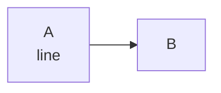
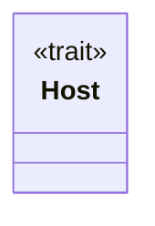

# Mermaid

```mermaid
flowchart LR
  a["A<br>line"] --> b["B"]
  click a callback
```

```mermaid
classDiagram
  class Host {
    <<trait>>
  }
```

```mermaid
sequenceDiagram
  A->>B: one; two
  A->>B: escaped #59; is fine
```
